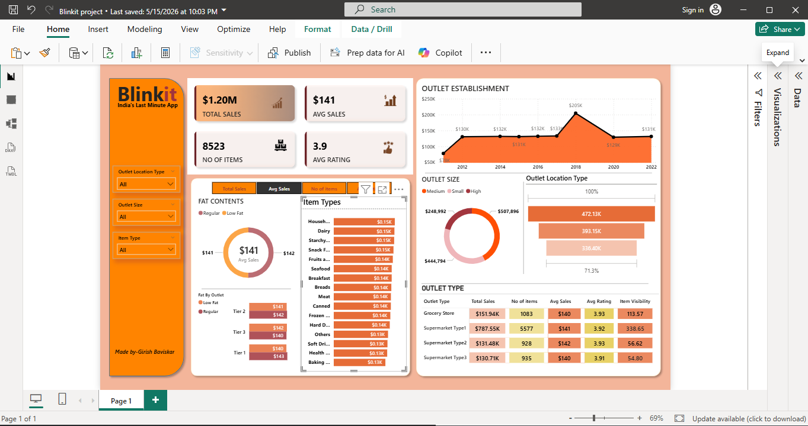
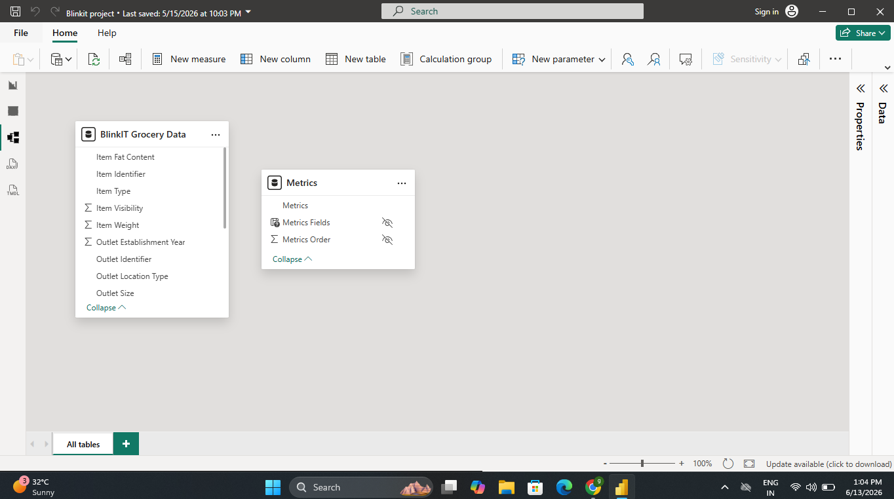

# Blinkit Grocery Sales Dashboard (Power BI)

## Project Overview

This Power BI dashboard analyzes Blinkit's grocery sales performance across different outlet types, outlet sizes, item categories, and locations.

The dashboard provides insights into sales trends, customer ratings, product performance, and outlet efficiency.

---
## 📊 Dataset Information

**Dataset Name:** BlinkIT Grocery Data

**File Format:** Excel (.xlsx)

**Dataset Features:**
- Item Fat Content
- Item Type
- Outlet Establishment Year
- Outlet Size
- Outlet Location Type
- Outlet Type
- Item Visibility
- Item Weight
- Sales
- Rating

**Total Records:** 8,523

**Dataset File:**
- `dataset/BlinkIT Grocery Data.xlsx`
---
## Dashboard Preview

### Main Dashboard

---

### Data Model

---

## Key Metrics

- Total Sales: $1.20M
- Average Sales: $141
- Number of Items: 8523
- Average Rating: 3.9

---

## Tools Used

- Power BI
- Power Query
- DAX
- Data Modeling

---

## Dashboard Features

- Sales Analysis
- Outlet Establishment Trends
- Outlet Size Analysis
- Outlet Location Analysis
- Item Type Performance
- Fat Content Analysis
- Outlet Type Comparison

---

## Business Insights

- Supermarket Type 1 generated the highest sales revenue.
- Medium-sized outlets contributed significantly to overall sales.
- Regular fat products outperformed low-fat products.
- Household and Dairy products were among the top-performing categories.

---

## Author

**Girish Sanjiv Baviskar**

- LinkedIn: www.linkedin.com/in/girish-baviskar-89a4443b0
- GitHub: https://github.com/DAGirishBaviskar
